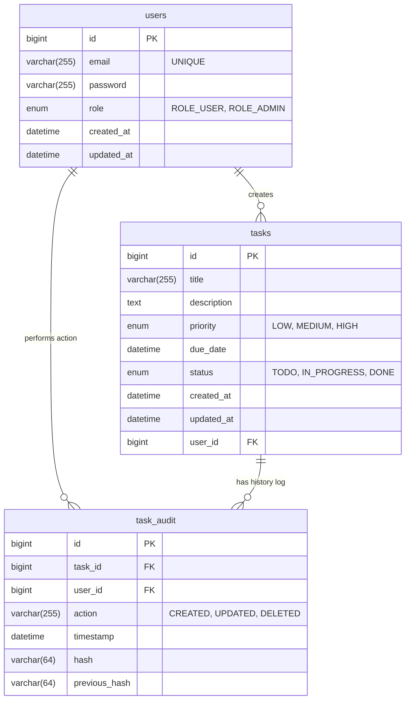

# AI-Powered Task Management Portal

A full-stack, AI-powered task management application with cryptographic audit logging and role-based access control.

## 🚀 Tech Stack Used

**Frontend:**
- React.js (Vite)
- Tailwind CSS
- Lucide React (Icons)
- Axios (API Calls)

**Backend:**
- Java 17
- Spring Boot 3.x
- Spring Security (JWT Authentication)
- Spring Data JPA
- Hibernate
- MySQL
- JUnit 5 & Mockito (Unit Testing)
- Swagger/OpenAPI (API Documentation)

**Infrastructure:**
- Docker & Docker Compose

## 🏗️ Architecture Overview

The application follows a clean, layered architecture pattern:
1. **Presentation Layer:** React single-page application with a dynamic, responsive UI.
2. **Controller Layer:** Spring Boot REST controllers (`AuthController`, `TaskController`, `AdminController`) that handle HTTP requests and secure endpoints using `@PreAuthorize`.
3. **Service Layer:** Contains business logic, AI integration (`AiService`), and blockchain audit logic (`AuditService`).
4. **Data Access Layer:** Spring Data JPA repositories interacting with the MySQL database.
5. **Security:** Stateless JWT authentication mechanism. Passwords are encrypted using BCrypt.

## ✨ AI Integration Explanation

The application integrates with the **Groq AI API** (using the `llama3-8b-8192` model) to implement the "AI Task Description Generator" automation feature.

**Workflow:**
1. The user enters a brief task "Title" (e.g., "Prepare client presentation").
2. The user clicks the **AI** button.
3. The React frontend sends the title to the Spring Boot backend.
4. The backend constructs a prompt and calls the Groq API.
5. The AI generates a detailed task description and intelligently recommends a task priority (`LOW`, `MEDIUM`, `HIGH`).
6. The backend parses the JSON response and streams it back to the frontend to instantly populate the form fields.

## 🔗 Blockchain Implementation (Bonus)

To satisfy the **Immutable Task History** bonus requirement, the application features a lightweight, cryptographically secure audit ledger.

Whenever a task is created or updated, the `AuditService` intercepts the action and generates a SHA-256 cryptographic hash combining:
- The Action (CREATED / UPDATED)
- The Task ID
- The User ID
- A timestamp
- The hash of the *previous* block

This creates an immutable, chained ledger of task updates. Admin users can view this cryptographic chain visually by clicking the "Sparkles" icon on any task in the UI.

## 🛠️ Setup Instructions

### Prerequisites
- Docker & Docker Compose

### Running the Application
1. Clone the repository.
2. Open a terminal in the root directory.
3. Start the application using Docker Compose:
   ```bash
   docker-compose up --build
   ```
4. The application will be available at:
   - **Frontend:** http://localhost
   - **Backend API:** http://localhost:8080
   - **API Documentation (Swagger):** http://localhost:8080/swagger-ui.html

### Authentication & Roles
- Register a new account via the UI.
- **Admin Access:** Register an account with the exact email `admin@admin.com`. The system will automatically grant this account `ROLE_ADMIN`, giving you access to the exclusive User Management Dashboard.

## 📡 Key API Endpoints

### Auth
- `POST /api/auth/register` - Register a new user
- `POST /api/auth/login` - Authenticate and receive JWT

### Tasks (Secured)
- `GET /api/tasks?page=0&size=10&search=..&status=..` - Fetch paginated/filtered tasks
- `POST /api/tasks` - Create a task
- `PUT /api/tasks/{id}` - Update a task
- `DELETE /api/tasks/{id}` - Delete a task
- `POST /api/tasks/generate-details` - Trigger AI generation

### Admin (Secured: ROLE_ADMIN)
- `GET /api/admin/users` - View all users
- `PUT /api/admin/users/{id}` - Edit a user's role or email
- `DELETE /api/admin/users/{id}` - Delete a user (and safely cascade delete their tasks/audit logs)
- `GET /api/admin/users/{id}/tasks` - View tasks belonging to a specific user

## 🗄️ Database Schema (ER Diagram)

The application uses a relational database (MySQL). Below is the Entity-Relationship (ER) diagram representing the database architecture:



## 📸 Screenshots

*(Please create a folder named `screenshots` in the root of the project and add the following images to it)*

- **Login / Registration:**
  

- **Mission Control (Task Board):**
  

- **AI Task Generation:**
  

- **Blockchain Audit Ledger:**
  

- **Admin User Management:**
  
